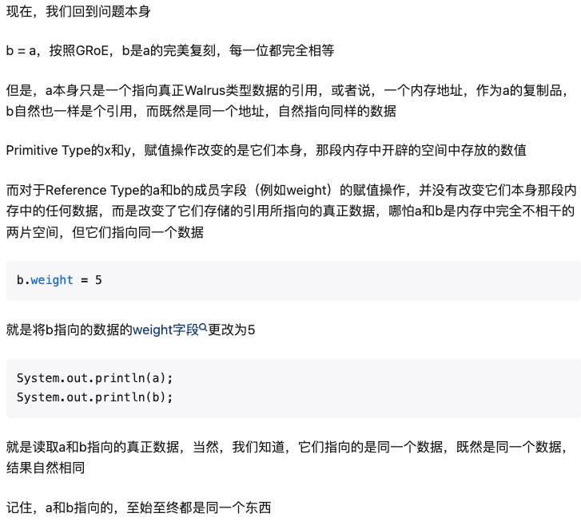

# 2. Lists

## Bits <a href="#the-mystery-of-the-walrus" id="the-mystery-of-the-walrus"></a>

所有的信息在电脑里通过0和1储存在内存里。有趣的事72和H都保存成01001000。电脑怎么区别她们的呢？

答案是通过类型。

```java
char c = 'H';
int x = c;
System.out.println(c);
System.out.println(x);
```

x 和 c 变量包含相同的bits，但是java 对待她们确不同

primitive types: byte, short, int, long, float, double, boolean, char

## Declaring a Variable

可以想象电脑里为了存储信息包括大量的bits，每个memory bit 有好一个唯一的地址。

当声明一个具体类型的变量，Java finds a contiguous block with exactly enough bits to hold a thing of that type。例如，如果你declare 一个int，得到一个32bits的块，如果declare一个byte，得到一个8bits的块。每个数据类型都有不同数量的bits。称为box of bits。

除了memory, java 解释器也创建一个entry在内表里，每个变量的名称对应box的第一个bit的位置，

&#x20;例如，声明 `int x` 和 `double y` , java 决定用内存从352到384来存储x，从bit 20800到20864来存储y。然后interpreter 记录int x 从bit 352开始，y从bit 20800开始

java隐藏memory locations。java 没有default values，所以除非使用=， java会阻止不让使用变量。

## The Golden Rule of Equals (GRoE)

This simple idea of copying the bits is true for ANY assignment using `=` in Java.

<figure><figcaption></figcaption></figure>

<figure><figcaption></figcaption></figure>

## Reference Types

Reference 类型

当我们用 `new` 要实例化一个对象, java 首先分配一个box 给类里的每一个实例变量，然后通过default value填充这些实例变量。 Constructor 往往填充这些box通过一些特定的值。

例如，

```java
public static class Walrus {
    public int weight;
    public double tuckSize;
    
    public Walrus(int w, double ts) {
        weight = w;
        tuckSize = ts;
    }
}
```

我们通过 `new Walrus(1000, 8.3)` 创建一个Walrus， Walrus包含两个box，分别是32bits 和  64bits。

<figure><figcaption></figcaption></figure>

## Reference Variable Declaration

当我们声明类型是reference的变量，java 分配一个64bits的box，不管对象是什么。这64bits包括的不是内容，是在memory 里的地址。

```java
Walrus someWalrus;
someWalrus = new Walrus(1000, 8.3);
```

第一行是创建一个64bits的box，第二行是创建一个新的`Walrus`，地址通过 `new` 来返回。这些bits再复制进 `someWalrus` box。

## Box and Pointer Notation

所以，我们创建一个simplified box for reference variable

* 如果一个地址全是0， 我们将用null表示。
* 一个非零地址可以表示一个箭头指向对象实例

称为"box and pointer"。

<figure><figcaption></figcaption></figure>

<figure><figcaption></figcaption></figure>

## Resolving the Mystery of the Walrus

```java
Walrus a = new Walrus(1000, 8.3);
Walrus b;
b = a;
```

<figure><figcaption></figcaption></figure>

## Parameter Passing

当pass 参数到function，我们也是复制bits。换句话说，GROE也应用到参数传递。 复制bits也叫做pass by value (传值)。

例如，

```java
public static double average(double a, double b) {
    return (a + b) / 2;
}
```


## Instantiation of Arrays

java array is fixed size.


## InLists

```java
public class IntList {
    public int first;
    public IntList rest;
    
    /** Return the size of the list using  recursion */
    public int size() {
        //first need a base case for recursion
        if (rest = null) {
            return 1;
        }
        return 1 + this.rest.size();
    
    }
    /** Return the sie of list using no recursion*/
    public int iterativeSize() {
        IntList p = this;
        int totalsize = 0;
        while (p != null) {
            totalsize += 1;
            p = p.rest;
        }
        return totalsize;
    }

    public IntList(int f, IntList r) {
        first = f;
        rest = r;
    }
    
    public static void main(String[] args) {
        IntList L = new IntList(15, null);
        L = new IntList(10, L);
        L = new IntList(5, L);
    }
}

```

建议用p提醒自己，变量hold a pointer。很需要p，因为不能重新配置this。


## SLLists

IntList&#x20;


